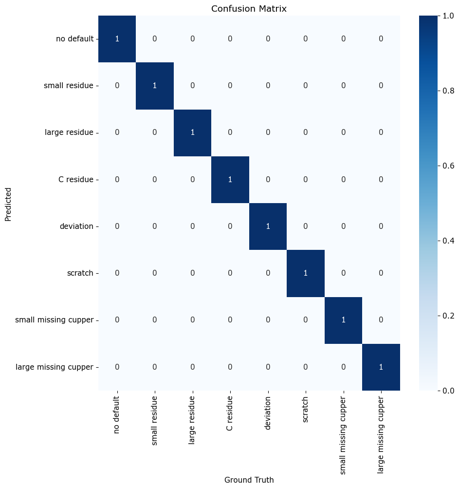

# Defect detection on wafermaps 

# Description
This project aims to develop a machine learning model for classifying defects on wafermaps. The model will be trained on a dataset of wafermaps with labeled defects, and will be able to predict the type of defect on new wafermaps. The project will use convolutional neural networks (CNNs) for feature extraction and classification. This project is particularly useful for the semiconductor industry as it can help improve the efficiency and yield of wafer manufacturing.

This is a description of what each folder or file do :  
- **labeled_img**: contains some labeled images with bounding box.
- **results**: contains the confusion matrix.
- **test-images**: contains some images to test the model.
- **artifacts/defect_5-v0**: contains the model weights for the detection task.
- **src**: contains the source code.
- **test**: contains the test code.
- **requirements.txt**: contains the required packages for the project.
- **README.md**: contains the description of the project.
 

# Visuals
Depending on what you are making, it can be a good idea to include screenshots or even a video (you'll frequently see GIFs rather than actual videos). Tools like ttygif can help, but check out Asciinema for a more sophisticated method.

# Installation

To clone the repository, run the following command in the terminal:  
```bash
git clone https://gricad-gitlab.univ-grenoble-alpes.fr/data-challenge-group-2/data-challenge.git
```

To install the required packages, run the following command in the terminal:  
```bash
pip3 install -r requirements.txt
```


# Usage
## Only classification
Use examples liberally, and show the expected output if you can. It's helpful to have inline the smallest example of usage that you can demonstrate, while providing links to more sophisticated examples if they are too long to reasonably include in the README.

## Classification with bounding box(less accurate)

For detection of the defect on a particular image :

```bash
python3 detect.py --mode detect --path path/to/image
```
An expected output for default path is shown below:  
The predicted class is: 20, with a confidence of:  0.9157724976539612  
The bounding box is:  [325.94244384765625, 334.8153991699219, 359.4962463378906, 367.59881591796875]
  
For evaluation on labeled dataset containing images of defects(the images name is in the format of "image_name_label.jpg"). 

```bash
python3 detect.py --mode eval --path path/to/dataset
```
An expected output on test_images folder is shown below:  
class_ratio:  0.9108119010925293  
weighted_acc:  1.0

A confusion matrix is saved in the results folder by default.
The confusion matrix given with previous command is shown below:
<center>

</center>
 


# Support

If you have questions, concerns, bug reports, etc, please file an issue in this repository's Issue Tracker.
Or you can contact me at:  [ahouzi2000@outlook.com]


# License
  
MIT License

Copyright (c) [2023] 

Permission is hereby granted, free of charge, to any person obtaining a copy
of this software and associated documentation files (the "Software"), to deal
in the Software without restriction, including without limitation the rights
to use, copy, modify, merge, publish, distribute, sublicense, and/or sell
copies of the Software, and to permit persons to whom the Software is
furnished to do so, subject to the following conditions:

The above copyright notice and this permission notice shall be included in all
copies or substantial portions of the Software.

THE SOFTWARE IS PROVIDED "AS IS", WITHOUT WARRANTY OF ANY KIND, EXPRESS OR
IMPLIED, INCLUDING BUT NOT LIMITED TO THE WARRANTIES OF MERCHANTABILITY,
FITNESS FOR A PARTICULAR PURPOSE AND NONINFRINGEMENT. IN NO EVENT SHALL THE
AUTHORS OR COPYRIGHT HOLDERS BE LIABLE FOR ANY CLAIM, DAMAGES OR OTHER
LIABILITY, WHETHER IN AN ACTION OF CONTRACT, TORT OR OTHERWISE, ARISING FROM,
OUT OF OR IN CONNECTION WITH THE SOFTWARE OR THE USE OR OTHER DEALINGS IN THE
SOFTWARE.


